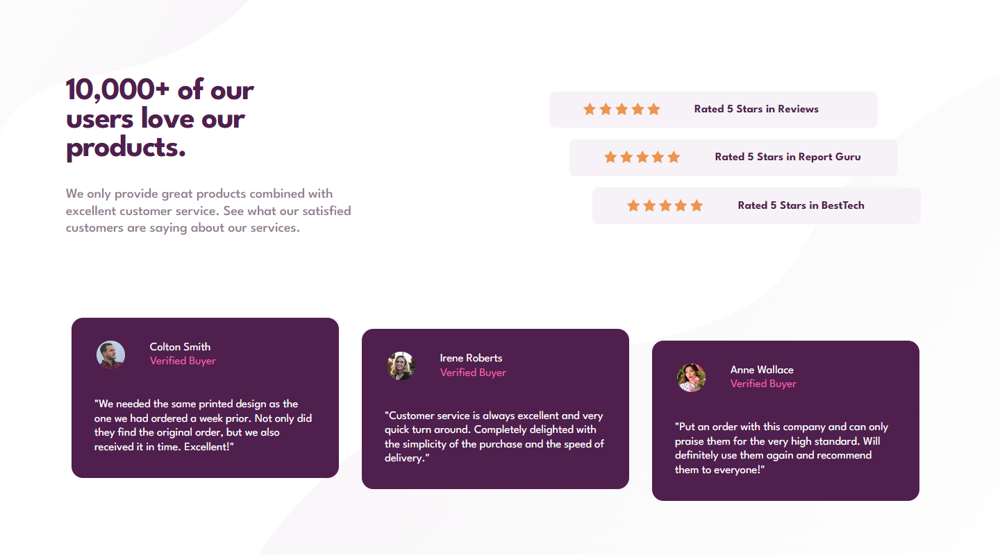
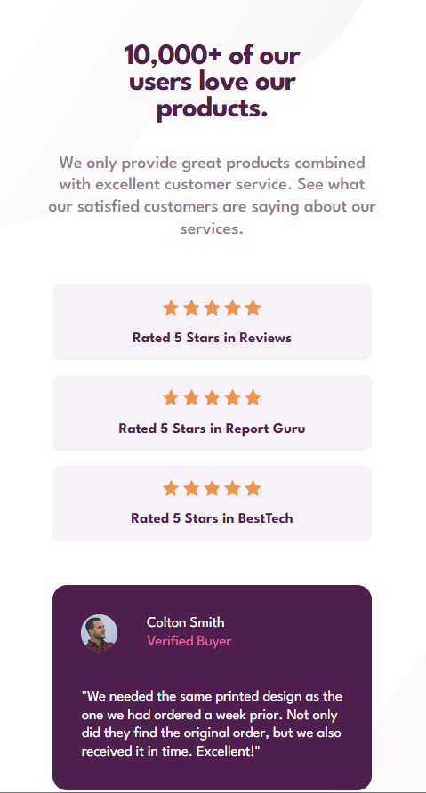

# Frontend Mentor - Social proof section solution

This is a solution to the [Social proof section challenge on Frontend Mentor](https://www.frontendmentor.io/challenges/social-proof-section-6e0qTv_bA). Frontend Mentor challenges help you improve your coding skills by building realistic projects. 

## Table of contents

- [Overview](#overview)
  - [The challenge](#the-challenge)
  - [Screenshot](#screenshot)
  - [Links](#links)
- [My process](#my-process)
  - [Built with](#built-with)
  - [What I learned](#what-i-learned)
  - [Continued development](#continued-development)
  - [Useful resources](#useful-resources)
- [Author](#author)
- [Acknowledgments](#acknowledgments)

**Note: Delete this note and update the table of contents based on what sections you keep.**

## Overview

### The challenge

Users should be able to:

- View the optimal layout for the section depending on their device's screen size

### Screenshot

### Links

- Solution URL: [Solution URL here](https://github.com/kwngptrl/FEM-social-proof-section-master)
- Live Site URL: [Add live site URL here](https://your-live-site-url.com)

## My process

### Built with

- Semantic HTML5 markup
- CSS custom properties
- Flexbox
- CSS Grid
- Mobile-first workflow
- Responsive design

### What I learned

This project is the first one where I had to use CSS grid. While grid was easy, I had an unexpected hiccup. Despite using grid-areas and the . (dot) to identify no-go areas, one of the testimonial cards kept going into the area between the title and the star ratings. It had to be forced into its place by using an nth-child(1) selector.

My progress was delayed by my confusion with background-size. The top-left and bottom-right svgs kept colliding with each other as the viewport was being resized. In the end, I had to settle with a slightly smaller bottom-right svg.

This project is my first attempt to use clamp and max() with vw units for responsiveness as the viewport was being dynamically resized. I only applied it with the title and description section, as doing it with the cards seem too much at this point. It did eliminate/reduce some code in the media queries, although I did found it hard to compute. A lot of number plugging and googling/reading was required.

Also, this project made me scratch my head a bit. In the testimonial cars, the quotes are not the regular " quotes. They seem to be the “ and ” with a space after and before, and I could not find anything on how to make it look that way with plain CSS. I didn't want to modify the HTML, since it wasn't like that to begin with. If anyone has any info I'd like to know how you did it.

### Continued development

Use this section to outline areas that you want to continue focusing on in future projects. These could be concepts you're still not completely comfortable with or techniques you found useful that you want to refine and perfect.

Grid will definitely be used much more going forward, especially with more complex layouts. I also want to address reesponsiveness with use of min(), max(), and clamp more, although browser backwards compatibility is a concern. But older browsers are used less and less these days.

### Useful resources

[An interesting read](https://utopia.fyi/blog/clamp) - About clamp and fluid typography.
[Linearly Scale font-size with CSS clamp() Based on the Viewport](https://css-tricks.com/linearly-scale-font-size-with-css-clamp-based-on-the-viewport/) - Amazing stuff here but with the caveat of the user doing zoom with CTRL + mousewheel.
[min, max, and clamp: three logical CSS functions to use today](https://web.dev/min-max-clamp/) - Helped me get my head around the use of the three functions. 

Backgrounds were a bit tricky for me, here are some resources I found:
[Using multiple backgrounds](https://developer.mozilla.org/en-US/docs/Web/CSS/CSS_Backgrounds_and_Borders/Using_multiple_backgrounds)
[How to Resize Background Images with CSS3](https://www.w3docs.com/snippets/css/how-to-resize-background-images-with-css3.html)

## Author

- Frontend Mentor - [@Wannacode](https://www.frontendmentor.io/profile/kwngptrl)

## Acknowledgments

This is where you can give a hat tip to anyone who helped you out on this project. Perhaps you worked in a team or got some inspiration from someone else's solution. This is the perfect place to give them some credit.

**Note: Delete this note and edit this section's content as necessary. If you completed this challenge by yourself, feel free to delete this section entirely.**
